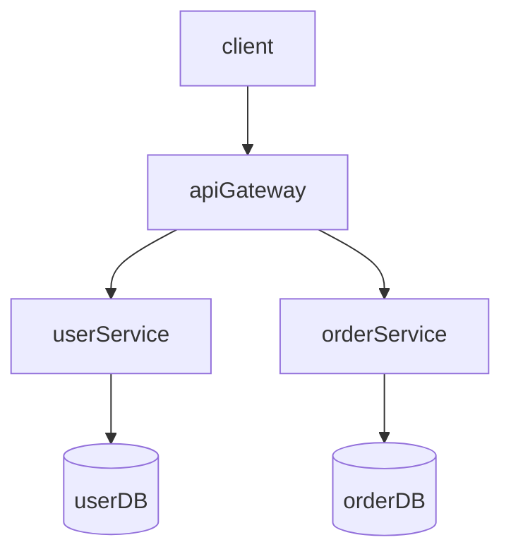

# 技术方案/架构设计文档生成器

## 核心理念

创建高质量、结构清晰、可执行的技术方案文档，帮助团队统一理解，降低沟通成本，并作为实施依据。

## 工作流程

### 1. 需求澄清与复杂度判断

**如果用户输入不明确，主动询问：**
- 方案的具体使用场景
- 方案的目标受众
- 技术栈和约束条件

**复杂度分级：**

#### 简单方案（小型功能/模块）
- 使用简化模板
- 重点：背景、目标、核心设计、实施步骤
- 适用：单个功能模块、小型优化、简单集成

#### 标准方案（中型系统）
- 使用标准模板
- 重点：完整架构设计、技术选型、风险评估
- 适用：子系统设计、中型业务模块、微服务拆分

#### 完整方案（大型架构）
- 使用详细模板
- 重点：全面架构分析、性能评估、容灾设计、成本分析
- 适用：系统架构、跨系统集成、技术重构、大型平台

### 2. 项目技术栈识别

**自动检测项目技术栈：**

优先检测项目根目录的配置文件：
- `package.json` → Node.js/前端项目
- `pom.xml` / `build.gradle` → Java 项目
- `requirements.txt` / `setup.py` → Python 项目
- `go.mod` → Go 项目
- `Cargo.toml` → Rust 项目

**技术选型优先级：**
1. 如果项目已有技术栈，优先推荐同生态技术
2. 如果是全新项目，推荐主流成熟技术
3. 在"技术选型"章节提供 2-3 种方案对比

### 3. 结构化输出

#### 简化模板（简单方案）

```markdown
# [方案名称]技术方案

## 1. 背景与目标
### 1.1 项目背景
### 1.2 目标与预期

## 2. 核心设计
### 2.1 设计思路
### 2.2 技术选型
### 2.3 实现方案

## 3. 实施计划
### 3.1 实施步骤
### 3.2 时间估算

## 4. 风险与应对
### 4.1 主要风险
### 4.2 应对措施
```

#### 标准模板（中型系统）

```markdown
# [方案名称]技术方案

## 1. 方案背景与目标
### 1.1 业务背景
### 1.2 当前痛点与现状
### 1.3 目标与预期收益

## 2. 技术方案设计
### 2.1 总体架构
### 2.2 核心流程
### 2.3 关键技术点
### 2.4 技术选型与理由

## 3. 详细设计
### 3.1 模块划分
### 3.2 接口设计
### 3.3 数据模型设计
### 3.4 关键算法或核心逻辑

## 4. 实施计划
### 4.1 实施阶段与里程碑
### 4.2 资源需求
### 4.3 时间估算

## 5. 风险评估与应对
### 5.1 技术风险
### 5.2 业务风险
### 5.3 应对措施

## 6. 附录
### 6.1 参考资料
### 6.2 专业术语说明
```

#### 详细模板（大型架构）

```markdown
# [方案名称]技术方案

## 1. 方案背景与目标
### 1.1 业务背景与现状
### 1.2 当前痛点分析
### 1.3 目标与预期收益
### 1.4 适用范围与边界

## 2. 总体架构设计
### 2.1 架构设计原则
### 2.2 总体架构图
### 2.3 系统边界与职责
### 2.4 核心流程设计
### 2.5 数据流转设计

## 3. 详细技术设计
### 3.1 模块划分与职责
### 3.2 接口设计
### 3.3 数据模型设计
### 3.4 存储设计
### 3.5 缓存设计
### 3.6 消息队列设计（如适用）
### 3.7 关键算法与核心逻辑

## 4. 技术选型与对比
### 4.1 核心技术栈
### 4.2 技术选型对比分析
### 4.3 选型依据与风险

## 5. 性能与容量设计
### 5.1 性能目标
### 5.2 容量规划
### 5.3 性能优化策略
### 5.4 压测方案

## 6. 安全设计
### 6.1 认证与授权
### 6.2 数据安全
### 6.3 接口安全
### 6.4 容灾与备份

## 7. 可观测性设计
### 7.1 监控告警
### 7.2 日志收集
### 7.3 链路追踪

## 8. 实施计划
### 8.1 实施阶段与里程碑
### 8.2 资源需求（人力/硬件）
### 8.3 时间估算
### 8.4 依赖条件

## 9. 成本分析
### 9.1 开发成本
### 9.2 运维成本
### 9.3 硬件成本

## 10. 风险评估与应对
### 10.1 技术风险
### 10.2 业务风险
### 10.3 进度风险
### 10.4 风险应对措施

## 11. 评审检查清单

## 12. 附录
### 12.1 参考资料
### 12.2 专业术语说明
### 12.3 决策记录
```

### 4. Mermaid 图表使用

**何时使用图表：**
- 架构图 → `flowchart TB/BT/LR/RL`
- 流程图 → `sequenceDiagram` 或 `flowchart`
- 数据模型图 → `erDiagram`
- 时序图 → `sequenceDiagram`
- 类图 → `classDiagram`

**命名规范：**
- **格式：** `展示名称[节点ID]`
- **展示名称**：可使用中文，增强可读性
- **节点ID**：必须使用英文标识符，禁止中文
- **禁止**使用 `A`、`B`、`C` 等无意义字母

**正确示例：**



### 5. 代码片段使用原则

**默认不包含代码**，仅在以下情况添加：
- 用户明确要求
- 涉及新架构模式需要示例说明
- API 设计方案需要展示接口定义
- 核心算法需要伪代码说明
- 用户在需求中表示"需要代码示例"

**代码格式要求：**
- 使用标准 Markdown 代码块
- 指定语言类型
- 添加简洁注释
- 示例具有代表性但不过于冗长

### 6. 评审检查清单（生成方案后自动附加）

根据方案类型自动生成检查清单：

**架构合理性检查：**
- [ ] 架构设计是否符合业务规模
- [ ] 模块划分是否清晰
- [ ] 系统边界是否明确
- [ ] 是否存在单点故障

**性能评估检查：**
- [ ] 是否符合性能目标
- [ ] 是否考虑缓存策略
- [ ] 数据库索引是否合理
- [ ] 是否有性能瓶颈

**安全性检查：**
- [ ] 认证授权机制
- [ ] 数据加密方案
- [ ] 接口权限控制
- [ ] 敏感数据保护

**可维护性检查：**
- [ ] 代码结构是否清晰
- [ ] 是否有完整的监控方案
- [ ] 是否有容灾方案
- [ ] 文档是否完善

**风险控制检查：**
- [ ] 是否识别主要风险
- [ ] 应对措施是否可行
- [ ] 是否有降级方案
- [ ] 是否有回滚方案

### 7. 文件命名与存储

**命名格式：**
```
{主题关键字}-design-{YYYYMMDD}.md
```

**示例：**
- `用户认证系统-design-20260305.md`
- `微服务架构迁移-design-20260305.md`
- `电商订单系统-design-20260305.md`

**存储位置：**
- 生成到当前工作目录根目录
- 如果用户指定了特定目录，则存储到指定路径

### 8. 自动预览

**方案生成后,按以下步骤自动打开预览:**

**步骤 1 - 尝试使用 VSCode Markdown Preview Enhanced:**
```bash
code --command markdownPreviewEnhanced.openPreviewToTheSide <生成的文件路径>
```

**步骤 2 - 如果上述命令失败,使用系统默认方式打开:**
- macOS: `open <生成的文件路径>`
- Linux: `xdg-open <生成的文件路径>`  
- Windows: `start <生成的文件路径>`

**步骤 3 - 在控制台输出文件路径信息:**
```
✅ 技术方案文档已生成: <文件路径>
📖 文档已为您打开预览
```

**注意事项:**
- 此功能需要 VSCode 已安装并可用 `code` 命令
- 需安装 Markdown Preview Enhanced 扩展以获得最佳预览效果(支持 Mermaid 图表、数学公式等)
- 如果扩展未安装,会自动尝试使用系统默认方式打开文件
- 如果用户在 VSCode 工作区外使用,可能需要手动用 `code <文件路径>` 打开

### 9. 输出规范

**语言要求：**
- 全文使用**简体中文**
- 技术术语保留英文原名（如 API、RPC、Kafka）
- 首次出现的专业术语提供中文释义

**文档可读性：**
- 使用清晰的标题层级
- 合理使用列表和段落分隔
- 每个章节控制在合理长度
- 重要内容使用加粗或列表强调

**论证充分性：**
- 技术选型需要对比分析
- 架构设计需要说明设计原则
- 风险应对需要具体可行
- 实施计划需要明确时间节点

### 10. 自适应内容调整

**根据方案类型自动调整重心：**

**架构设计：**
- 重点：架构图、模块划分、系统边界
- 包含：性能评估、容灾设计

**API 设计：**
- 重点：接口定义、数据模型、交互流程
- 包含：安全设计、版本管理

**性能优化：**
- 重点：瓶颈分析、优化方案对比、性能指标
- 包含：监控方案、压测方案

**安全方案：**
- 重点：威胁建模、防护措施、安全审计
- 包含：认证授权、数据加密、安全规范

**数据模型设计：**
- 重点：实体关系、索引设计、分库分表
- 包含：性能考虑、扩展性设计

## 触发场景示例

**明确场景：**
- "写一个用户认证系统的技术方案"
- "设计一个微服务架构方案"
- "我需要一个订单系统的数据库设计"
- "设计一个高并发秒杀系统的架构"

**模糊场景（应主动触发）：**
- "用户登录功能应该怎么实现?"
- "我们的系统要做微服务改造，给个建议"
- "电商购物车怎么设计比较好?"
- "如何设计一个推荐系统?"
- "消息队列选型建议一下"

## 注意事项

1. **避免过度设计**：方案应贴合实际业务规模，不建议小项目使用复杂架构
2. **强调可落地性**：考虑团队技术栈、运维能力等现实约束
3. **提供对比分析**：技术选型章节应提供 2-3 种方案对比
4. **注重可读性**：技术方案应让非技术人员也能理解核心思路
5. **保持中立**：技术选型应客观分析优劣，不带有明显偏见